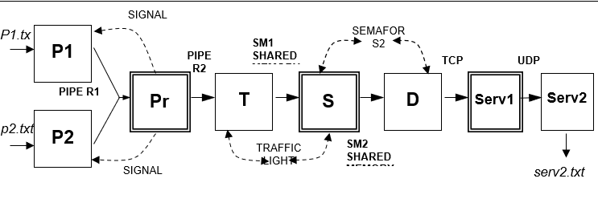
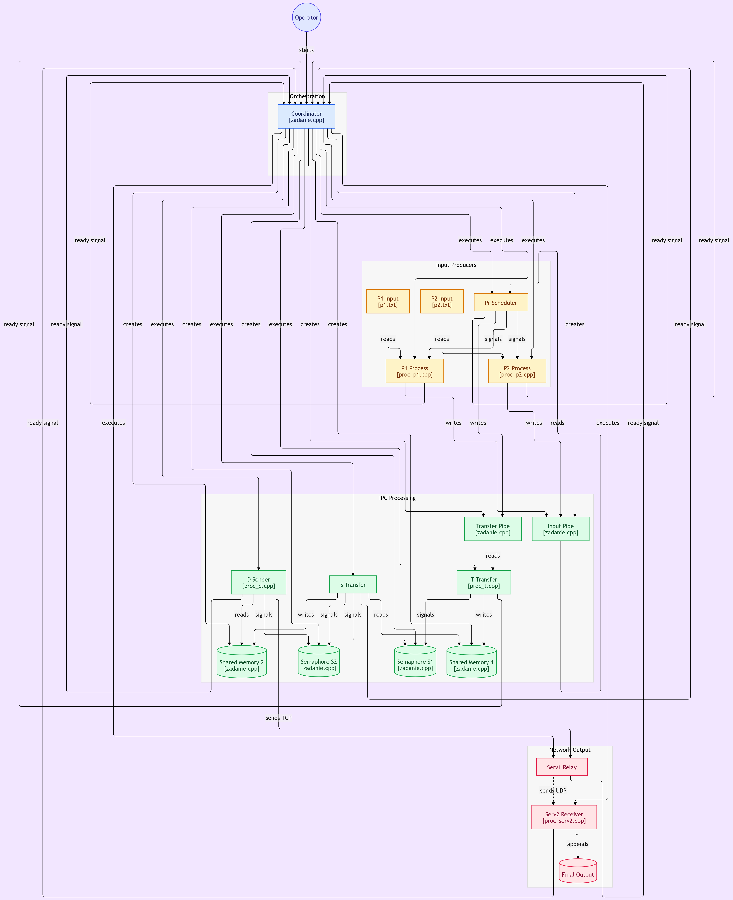

<div align="center">

# IPC pipeline

**Eight cooperating Linux processes move words from two text files to a final output file — through pipes, signals, System V shared memory and semaphores, then TCP and UDP sockets. One coordinator forks the chain, waits for every process to report ready, and tears the IPC objects down at the end.**


[](LICENSE)

[Quick start](#quick-start) · [How it works](#how-it-works) · [Processes](#processes) · [IPC mechanisms](#ipc-mechanisms) · [Layout](#repository-layout)

</div>

---

Each word in `p1.txt` and `p2.txt` travels the same route: a producer reads it on a signal, writes it into a pipe, a scheduler forwards it to a second pipe, two hops of shared memory guarded by semaphores carry it across process boundaries, and finally it is sent over TCP to a relay that forwards it over UDP to the receiver, which appends it to `serv2.txt`.

<p align="center">
  
  <br>
  <sub>Double-bordered boxes (<code>Pr</code>, <code>S</code>, <code>Serv1</code>) are the prebuilt binaries; the rest is built from source.</sub>
</p>

## Quick start

Linux with `g++` and `make`. Six processes are built from source; `proc_pr`, `proc_s` and `proc_serv1` ship as prebuilt Linux binaries in the repository root.

```bash
git clone https://github.com/ivanstavytskyi/ipc.git
cd ipc
make                      # builds zadanie, proc_p1, proc_p2, proc_t, proc_d, proc_serv2
./zadanie 5000 5001       # <TCP port for Serv1> <UDP port for Serv2>
cat serv2.txt             # every word from p1.txt and p2.txt, one per line
make clean                # removes binaries, *.out, *.err and serv2.txt
```

Pick any two free ports. The coordinator prints each fork and each readiness signal it receives; the processes log what they read and write, so the whole hand-off is visible in the terminal.

<!-- Demo: record a terminal GIF of `make && ./zadanie 5000 5001 && cat serv2.txt` and add it as docs/media/run.gif -->

## How it works

<p align="center">
  
</p>

`zadanie` is the coordinator. On start it:

1. Creates two anonymous pipes (`R1`, `R2`), two 151-byte shared-memory segments (`SM1`, `SM2`) and two semaphore sets (`S1`, `S2`), each with two semaphores initialised to `1` and `0` — a hand-off pair for writer and reader.
2. Installs a `SIGUSR1` handler that counts readiness reports.
3. Forks and `execl`s the children **in dependency order** — `P1`, `P2`, `Pr`, `T`, `S`, `Serv1`, `Serv2`, `D` — passing pipe descriptors, IPC ids and ports as command-line arguments. After each fork it blocks in `pause()` until that child sends `SIGUSR1`, then gives it a few seconds to settle.
4. Once all eight have reported ready and the chain has drained, it closes the pipes, sends `SIGTERM` to every child, `wait()`s for them and removes the shared-memory segments and semaphore sets with `IPC_RMID`.

Every child does the same first thing: set up, then `kill(getppid(), SIGUSR1)`. That single convention is what lets the coordinator start the chain deterministically instead of racing.

A step-by-step walkthrough of every hand-off, with the full communication scheme, is in [`documentation.docx`](documentation.docx).

## Processes

| Process | Source | Role | In | Out |
|---|---|---|---|---|
| `zadanie` | `zadanie.cpp` | Coordinator: creates IPC objects, forks the chain, waits for readiness, cleans up | ports | — |
| `proc_p1` | `proc_p1.cpp` | Producer: on every `SIGUSR1` from `Pr` reads one line (≤150 chars) from `p1.txt` | `p1.txt`, signal | pipe `R1` |
| `proc_p2` | `proc_p2.cpp` | Producer: same for `p2.txt` | `p2.txt`, signal | pipe `R1` |
| `proc_pr` | *prebuilt binary* | Scheduler: alternately signals `P1` and `P2`, forwards words from `R1` to `R2` | pipe `R1` | pipe `R2`, signals |
| `proc_t` | `proc_t.cpp` | Reads a word from `R2`, takes `S1[0]`, copies it into `SM1`, releases `S1[1]` | pipe `R2` | `SM1` |
| `proc_s` | *prebuilt binary* | Copies each word from `SM1` to `SM2`, driven by `S1` / `S2` | `SM1` | `SM2` |
| `proc_serv1` | *prebuilt binary* | TCP server on `port1`; relays every received word over UDP to `port2` | TCP | UDP |
| `proc_serv2` | `proc_serv2.cpp` | UDP receiver bound to `127.0.0.1:port2`; appends each datagram as a line to `serv2.txt` | UDP | `serv2.txt` |
| `proc_d` | `proc_d.cpp` | Waits on `S2[1]`, reads `SM2`, sends the 151-byte buffer over TCP to `Serv1`; an empty word ends the stream | `SM2` | TCP |

The prebuilt binaries also write `<name>.out` and `<name>.err` logs next to themselves (see `info.txt`).

## IPC mechanisms

| Mechanism | Where | Calls |
|---|---|---|
| **Anonymous pipes** | `P1`/`P2` → `Pr` (`R1`), `Pr` → `T` (`R2`). Descriptors are inherited through `fork` and passed as argv | `pipe`, `read`, `write` |
| **Signals** | Readiness: every child → coordinator (`SIGUSR1`, counted in a `sig_atomic_t`). Scheduling: `Pr` → `P1`/`P2` (`SIGUSR1` = “emit the next word”). Shutdown: coordinator → children (`SIGTERM`, handled to `shmdt` before exit) | `sigaction` with `SA_SIGINFO`, `kill`, `pause` |
| **Shared memory** | `SM1` between `T` and `S`, `SM2` between `S` and `D`; 151 bytes = one word + terminator | `shmget(IPC_PRIVATE)`, `shmat`, `shmdt`, `shmctl(IPC_RMID)` |
| **Semaphores** | One two-element set per segment: `[0]` guards the writer, `[1]` wakes the reader — a strict alternation so a word is never overwritten before it is read | `semget`, `semctl(SETVAL)`, `semop` |
| **TCP** | `D` connects to `Serv1` on `127.0.0.1:port1` and streams fixed 151-byte records | `socket(SOCK_STREAM)`, `connect`, `write` |
| **UDP** | `Serv1` sends each word as a datagram to `Serv2` on `127.0.0.1:port2` | `socket(SOCK_DGRAM)`, `bind`, `recvfrom` |
| **fork / exec** | Coordinator spawns all children with `fork` + `execl`, passing state only through argv, inherited descriptors and IPC ids | `fork`, `execl`, `wait` |

## Repository layout

```text
ipc/
├── LICENSE            MIT
├── Makefile           builds the six local binaries; `make clean` removes outputs
├── zadanie.cpp        coordinator
├── proc_p1.cpp        producer for p1.txt
├── proc_p2.cpp        producer for p2.txt
├── proc_t.cpp         pipe R2 → shared memory SM1
├── proc_d.cpp         shared memory SM2 → TCP
├── proc_serv2.cpp     UDP → serv2.txt
├── proc_pr            prebuilt: scheduler between P1/P2 and T
├── proc_s             prebuilt: shared memory SM1 → SM2
├── proc_serv1         prebuilt: TCP → UDP relay
├── p1.txt, p2.txt     sample input, one word per line
├── info.txt           notes on the prebuilt binaries and their *.out / *.err logs
├── documentation.docx detailed communication scheme and walkthrough
└── docs/media/        communication chain and process graph used in this README
```

## Notes

- Everything binds to `127.0.0.1`; nothing is exposed on the network.
- IPC objects are created with `IPC_PRIVATE` and their ids are passed to children as arguments, so nothing is keyed on a filesystem path. If a run is interrupted before cleanup, remove leftovers with `ipcs` / `ipcrm`.
- The coordinator uses fixed sleeps between forks to give each stage time to start. That keeps the assignment simple; a production design would replace the sleeps with the readiness signals alone.

## License

[MIT](LICENSE) © Ivan Stavytskyi
